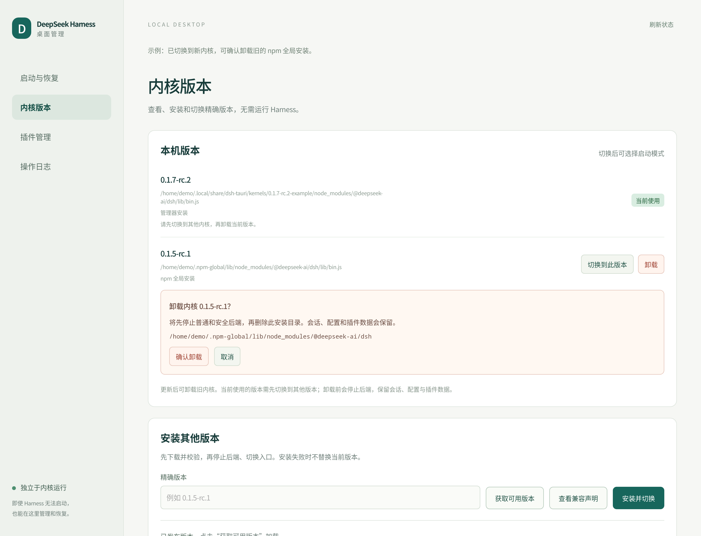

# DeepSeek Harness Manager

DeepSeek Harness 的独立桌面启动器、恢复入口和版本管理器。普通工作窗口仍直接使用内核自带的 WebUI；管理页面由外壳提供，即使没有安装内核或内核已经损坏，也能打开。

## 界面预览

从同一个管理器进入日常环境、安全模式和版本恢复。下图使用当前界面与固定演示数据生成，用户路径及运行状态为示例。


| 查找并选择内核版本 | 升级前检查插件声明 |
| --- | --- |
| [](docs/examples.md#2-获取内核版本) | [](docs/examples.md#3-候选内核与插件兼容性) |
| **插件版本不匹配** | **选择声明匹配的版本** |
| [](docs/examples.md#5-插件版本不匹配) | [](docs/examples.md#6-插件声明匹配) |
| **无内核仍可恢复** | **无内核仍可查看声明** |
| [](docs/examples.md#7-没有内核也能打开管理器) | [](docs/examples.md#8-没有内核也能查看兼容声明) |
| **管理已装插件** | **查询失败与重试** |
| [](docs/examples.md#4-管理已装插件) | [](docs/examples.md#9-查询失败与重试) |

**[查看完整 10 图操作示例 →](docs/examples.md)**，包含已装插件管理、查询失败与重试，以及截图复现方法。版本信息为文档快照；“声明匹配”不代表实际启动验证通过。

## 启动

Linux / macOS：

```sh
./Start-DSH.sh            # 打开独立管理页面，不启动内核
./Start-DSH.sh --normal   # 打开管理页并连接普通后端
./Start-DSH.sh --safe     # 打开管理页并启动安全模式
./Start-DSH.sh --build-only
```

Windows + WSL 使用 `Start-DSH.ps1`，对应参数为 `-Normal`、`-Safe`、`-Manage`、`-BuildOnly`。Windows 脚本不再通过 WSL 检查内核才允许启动外壳；具体管理操作在所配置的 WSL 用户环境中执行。Windows / macOS 本次未做真机验收。

外壳只在自身源码、构建配置或二进制变化时重建。内核升级、降级、缺失都不会再触发版本绑定或阻止管理窗口打开。构建依然需要 Rust / Tauri 系统依赖；管理操作需要 Python 3，安装内核需要 Node.js 和 npm，安装插件需要 pnpm。管理器没有依赖 Harness 的 HTTP 管理 API。

## 安全模式

安全模式在另一个端口、独立的全新 `DSH_HOME` 和单独的 WebView Cookie 存储中启动，仅声明两个随内核交付的官方 bundle：

- `@deepseek-ai/dsh-base`
- `@deepseek-ai/dsh-web-app`

Harness 自身采用插件架构，因此“完全零插件”无法提供 WebUI。此处的安全模式保证启动时不加载第三方插件、日常 profile、用户覆盖 patch、快照和项目 `.env`。它保留运行 Harness 所必需的官方组件。

每次新的安全启动都会创建干净目录，不复制会话、密钥或模型配置。日常数据不会被安全模式修改；安全环境需要单独配置模型。安全目录保留在 `management_home/safe-runs/`，停止只结束外壳记录且身份仍匹配的进程，不删除其中的数据。安全进程不会随管理窗口关闭而退出，可以再次打开管理页停止它。

安全模式不能修复损坏的内核本身；这种情况使用独立版本管理。该模式隔离的是启动配置和第三方插件，不是额外的操作系统安全沙箱。

## 内核管理



在“内核版本”中查看当前版本及本机保留版本，查询 npm 上的版本，安装精确版本号或切换到本机版本。没有内核时也能查询、安装。

“获取可用版本”会直接显示可滚动的版本列表，标注 npm 发布标签和预发布版本。选择版本会自动读取该精确版本的元数据；手动输入版本时点击“查看兼容声明”。查询失败和无发布版本会明确显示，不把空列表当作查询成功。

候选内核页面同时检查各 profile 已装插件的 DSH peer 声明，展示与目标内核的匹配结果；展开插件可看每个依赖包名和原始范围。此检查不需要启动当前或候选内核。

安装流程：

1. 在管理器自己的临时安装目录下载候选版本，不覆盖当前版本。
2. 固定官方内核子包版本，协调声明的精确基础依赖并去重，避免旧 npm 发布包浮动依赖混装。
3. 检查版本号，在临时干净环境启动 WebUI，验证认证和启动清单。
4. 安装通过后，停止普通后端与安全后端，原子切换 `dsh` 符号链接。
5. 后端保持停止，由用户选择普通或安全模式启动。

更新并切换到新内核后，在“本机版本”中点击旧版本的“卸载”。确认区域会列出版本号和实际删除目录，支持取消。卸载先停止普通和安全后端，只移除该安装的程序文件，保留会话、配置和 profile 插件；完成后可重新启动当前内核。

当前选用的内核不能直接卸载，需先切换到另一个版本。支持管理器安装的版本，以及首次切换时记录的原 npm 全局安装；其他外部安装会提示使用原安装方式处理。同一版本的多份安装按入口路径分别管理，卸载一份不会移除另一份。卸载完成的版本如需再次使用，需要重新安装。[查看卸载图文示例](docs/examples.md#10-更新后卸载旧内核)。

已安装版本放在 `management_home/kernels/`。当前可用安装和原始入口仍可切回；这里不复制用户数据，也不会声称旧内核能读取新版写入的数据。切换内核前后若涉及数据格式迁移，需按版本本身的兼容性处理。

普通后端的服务入口应调用相同的 `dsh` 符号链接，例如 `~/.npm-global/bin/dsh web --no-open`。如果入口是自定义普通文件，管理器拒绝覆盖；可以通过 `core_executable` 指定可管理的绝对符号链接路径。外部 `npm install -g` 仍可能覆盖这个链接；刷新管理页面可重新检测实际版本。

安装失败不会切换当前入口。若候选版本已安装但停止服务失败，该版本会保留在本机列表中供稍后切换。所有版本管理操作均串行加锁。

## 插件管理

管理器直接读取 `$DSH_HOME/profiles/<name>/package.json`、已安装包元数据和版本声明，不导入第三方插件代码。

支持：

- 查看各 profile 的已安装版本、依赖声明、bundle 启用状态及内核 peer 声明。
- 无需启动内核，查询并安装插件精确版本，升级或回退。
- 选择候选版本后显示其完整 DSH peer 声明、可选依赖标记、Node.js engines 要求及与当前内核的匹配结果；其他 peer 声明可展开查看。
- 启用、停用或移除第三方 bundle。
- 保留本地 `link:` / `file:` 源码插件，允许停用、移除，但不使用注册表版本覆盖本地源码。

操作前先停止普通后端，避免 HMR 读取更新一半的依赖；完成后手动启动。安装通过 pnpm 执行，使用 `--ignore-scripts`，有构建需求的包需要在终端按插件说明单独处理。本地源码的 Git 版本由其项目管理，管理器不自动改写源码。

启用/停用作用于 profile 的 `dsh.profile.bundles`；用户在 `cordis.patch.yml` 中自行注入的额外条目仍应在对应 patch 中处理。安全模式不读取这些 patch，因此仍可用于排查。声明的 peer 兼容范围不等于运行验证通过。内核组件不能通过插件管理单独替换或移除。

兼容检查使用 npm 自带的 semver，无需导入内核或插件代码。DSH peer 范围按[官方声明规则](https://github.com/deepseek-ai/deepseek-harness/blob/master/packages/boot/app-boot/README.md)包含预发布版本，`workspace:*` / `workspace:^` / `workspace:~` 指向运行时版本。所有 DSH peer 都必须匹配；无效范围单独标明。没有声明显示“未声明”，缺少内核或无法计算显示“未核验”，都不会显示为匹配。其他 peer 和非 Node.js engines 只展示原始声明，不推断本机已满足。查询使用当前 npm registry 配置，网络超时可以重试。

pnpm 失败时会显示日志，普通后端保持停止。检查和修复依赖后再启动；管理器不把失败的依赖操作显示为成功。

## 配置

复制 `backend.example.json` 为 `backend.json`，设置实际路径。Linux 配置示例：

```json
{
  "home": "/home/alice",
  "port": 3080,
  "safe_port": 3081,
  "journal_unit": "dsh-web.service"
}
```

| 配置 | 用途 |
| --- | --- |
| `home` | 后端 Unix 用户目录；Windows 下为 WSL 用户目录 |
| `port` | 普通后端端口 |
| `safe_port` | 可选，默认 `port + 1`，必须不同 |
| `journal_unit` | 可选，systemd 用户服务名，用于连接、启动和停止普通后端 |
| `launcher` | 可选，启动脚本，支持 `start` 与 `stop`；相对路径以 `home` 为基准 |
| `log_glob` | 可选，用于发现普通后端认证 URL 的日志路径或 glob |
| `dsh_home` | 可选，默认 `home/.dsh`；应与普通服务实际使用的数据目录一致 |
| `management_home` | 可选，默认 `home/.local/share/dsh-tauri` |
| `core_executable` | 可选，可管理的 `dsh` 符号链接绝对路径 |
| `distribution` / `user` | Windows + WSL 必填 |

配置了 `journal_unit` 时优先使用该服务。普通后端已运行但没有停止方式时，版本管理会拒绝修改安装。端口被未知进程占用时不会强行接管。

如果服务使用自定义 `DSH_HOME`，需同步设置 `dsh_home`。`launcher` 运行时应自行使用正确的数据目录和同一内核入口。

## 管理边界与日志

- Tauri 维护命令只授权给本地 `manager` 窗口，并再次校验调用窗口的标签及 URL。
- 普通 / 安全 WebUI 无维护 IPC 权限，不能调用安装、卸载或进程控制接口。
- 后端窗口只允许导航到自己的本机端口，认证 token 不返回到管理页面。
- 包名、精确版本及 profile 路径有输入校验。包管理器使用参数数组，不拼接 shell 命令。
- 安全后端使用记录的进程身份避免误杀复用 PID 的无关进程。
- 管理日志位于 `management_home/maintenance.log`；UI 展示有界尾部并隐藏 URL token。

外壳的 Linux 构建和桌面日志仍位于 `build-linux.log`、`desktop-linux.log`。管理页面出错后保持打开，可以重试、切换版本或查看日志。

## 验证

```sh
python3 -m unittest discover -s scripts -p 'test_*.py'
node --check ui/manager.js
python3 scripts/check-plugin-management.py  # 使用临时本机注册表，不修改用户插件
cargo test --locked
./Start-DSH.sh --build-only
```

测试覆盖无内核管理、干净环境隔离、拒绝越界 profile、保护官方组件、下载失败保留当前内核、原子切换、进程身份、单操作锁和远程 WebUI 拒绝维护权限。WebKit 认证回归仍可使用 `scripts/check-webkit-auth.py`。

`python3 -B scripts/check-manager-ui.py` 在有图形会话和 Python GI / WebKit2 4.1 的环境中验证可见版本列表、选择候选版本、无内核声明查看、查询失败提示和过期响应丢弃。使用模拟 IPC，不修改本机安装；可传入项目路径和截图输出路径。
