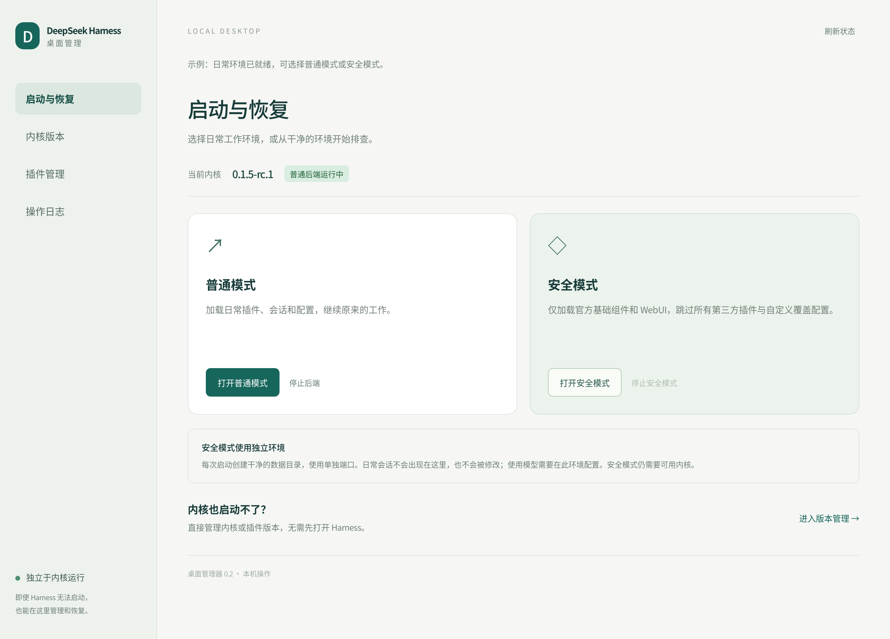
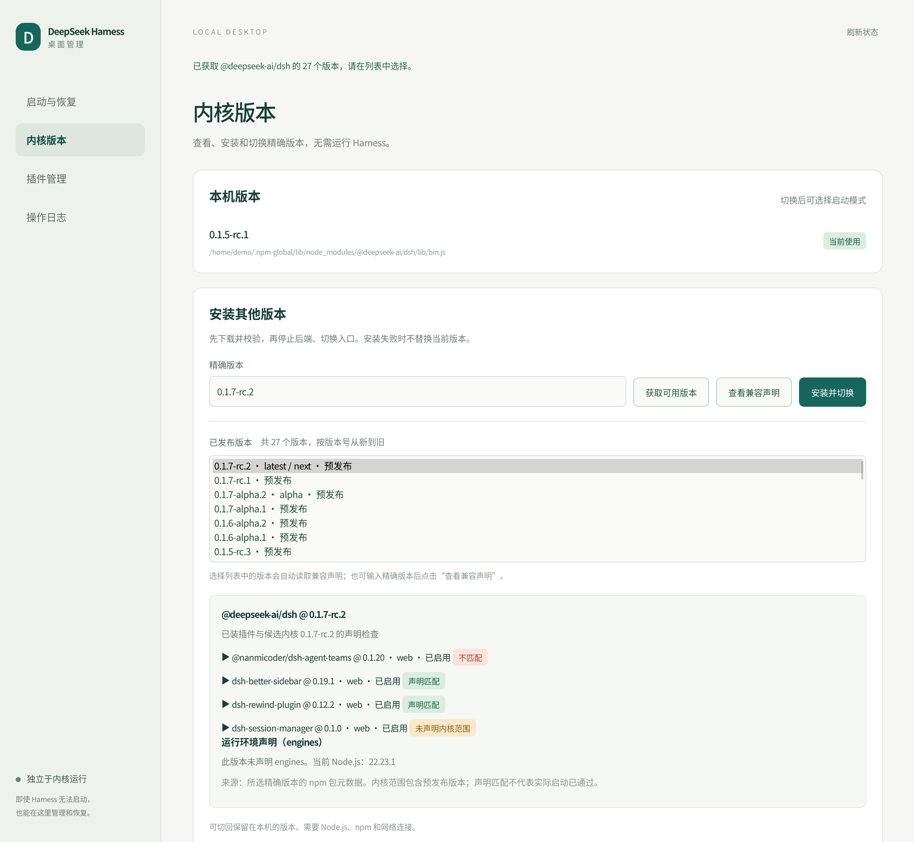
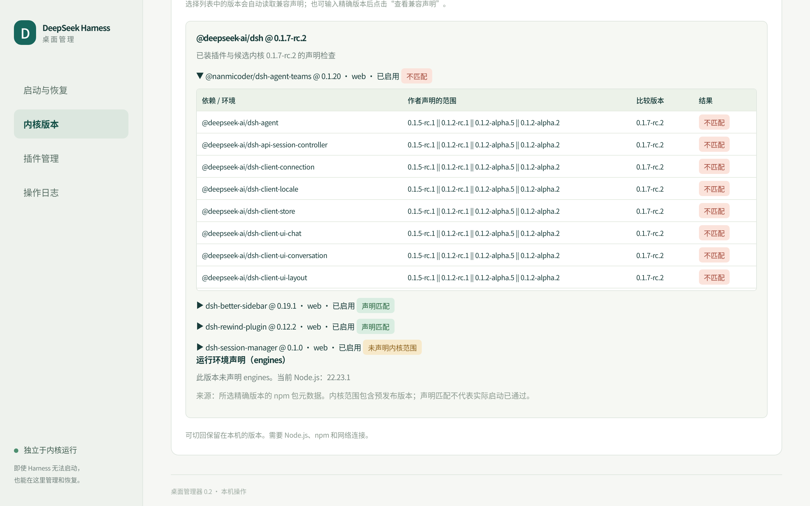
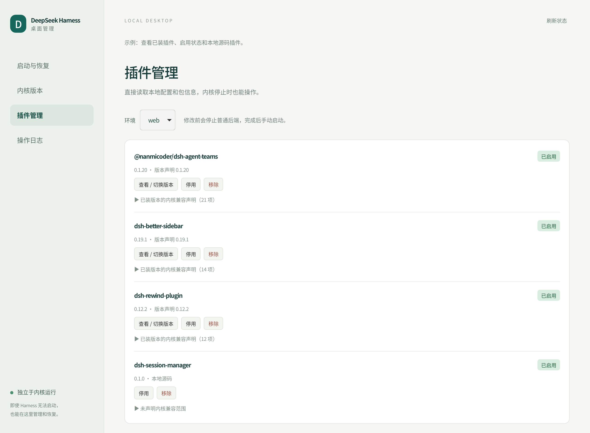
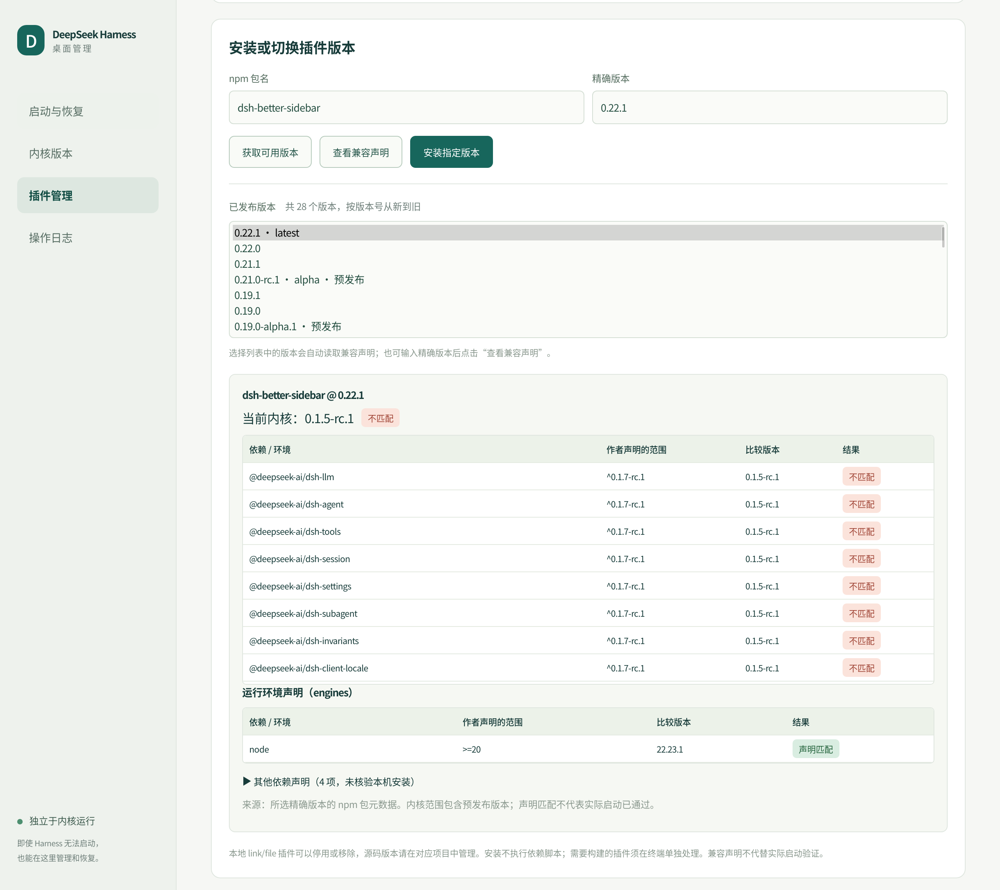
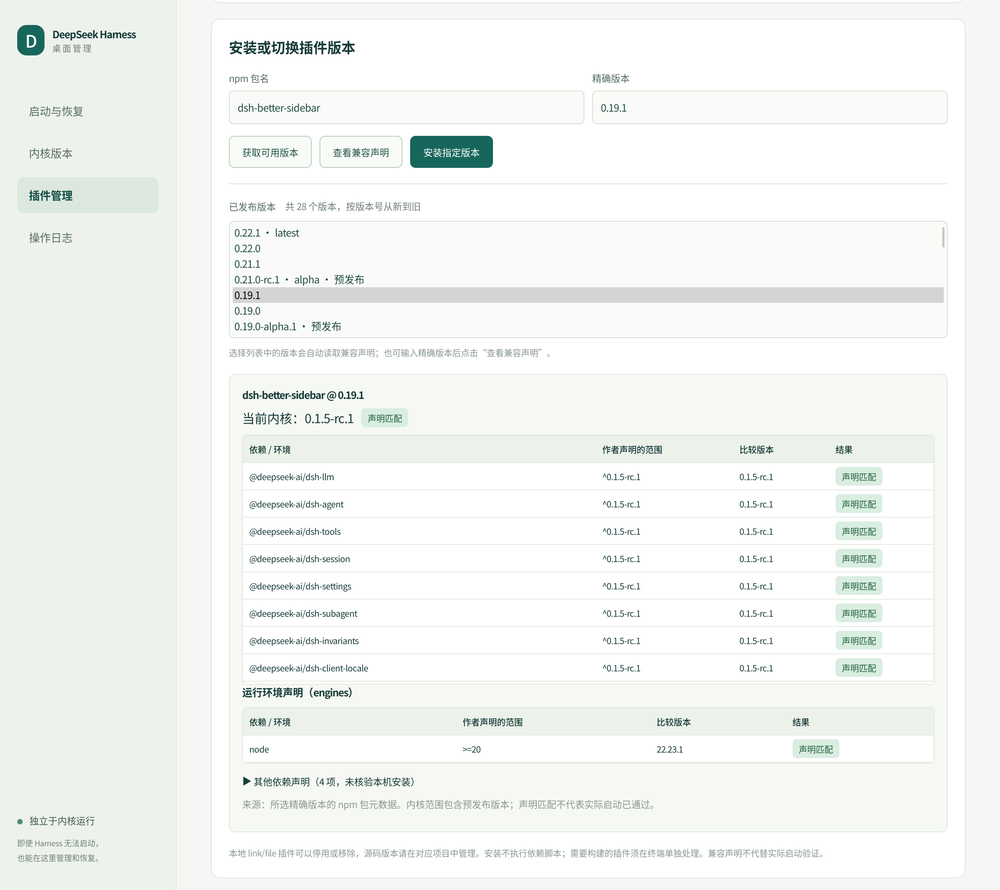
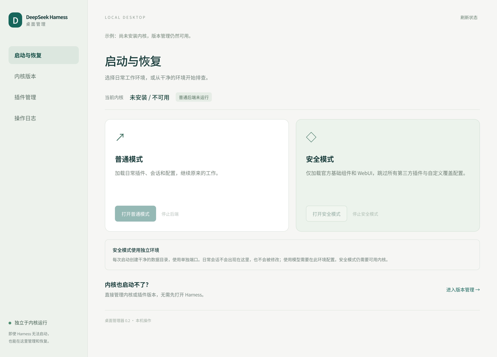
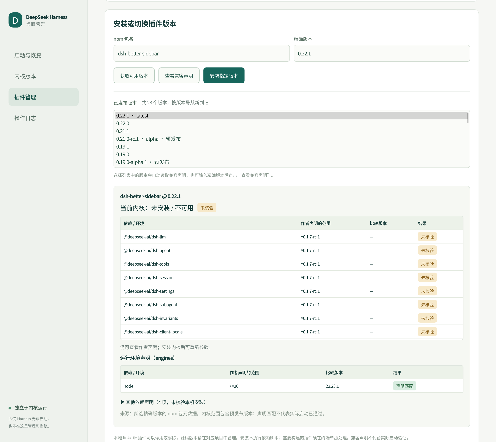
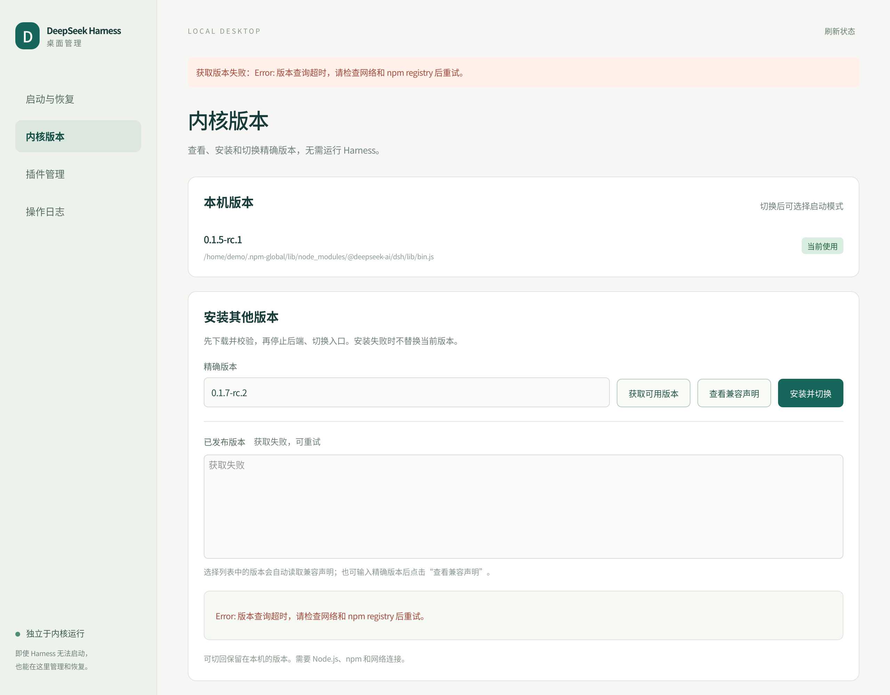

# 图文操作示例

[返回项目首页](../README.md)

以下 9 张截图使用当前管理器的真实 HTML / CSS / JavaScript，在 WebKit 中配合固定演示数据生成。用户名、路径和后端运行状态为示例；版本列表及兼容声明使用 2026-09-28 获取的 npm 元数据快照，不代表最新发布状态。截图不包含真实会话、密钥或工作区内容，也不表示截图中的版本已完成运行验证。

| 想完成的操作 | 对应示例 |
| --- | --- |
| 日常启动，或跳过第三方插件排查问题 | [启动与安全模式](#1-启动与安全模式) |
| 查看可以安装的内核版本 | [获取内核版本](#2-获取内核版本) |
| 升级内核前检查现有插件 | [候选内核与插件兼容性](#3-候选内核与插件兼容性) |
| 查看、停用或切换插件 | [管理已装插件](#4-管理已装插件) |
| 判断某个插件版本是否符合当前内核 | [不匹配示例](#5-插件版本不匹配)、[匹配示例](#6-插件声明匹配) |
| 内核尚未安装或已经损坏 | [无内核恢复](#7-没有内核也能打开管理器)、[无内核查看声明](#8-没有内核也能查看兼容声明) |
| 获取不到版本 | [查询失败与重试](#9-查询失败与重试) |

## 1. 启动与安全模式

打开管理器，先查看当前内核和普通后端状态。日常使用点击“打开普通模式”；怀疑第三方插件导致启动异常时，点击“打开安全模式”。安全模式使用独立环境，仅加载官方基础组件和 WebUI，日常会话不会出现在该环境中。



安全模式需要一个可用内核。如果内核本身不可用，先进入版本管理；不要把“安全模式”理解为无需内核的工作窗口。

## 2. 获取内核版本

进入“内核版本”，点击“获取可用版本”。列表直接展示精确版本号、发布标签和预发布标记，选择一项后自动读取对应版本的声明。也可以手动输入精确版本并点击“查看兼容声明”。



列表中的 `latest` 是发布标签；它不表示这个版本适合所有已装插件。查看下面的检查结果后，再决定是否安装。

## 3. 候选内核与插件兼容性

此例选择内核 `0.1.7-rc.2`。已装的 `@nanmicoder/dsh-agent-teams 0.1.20` 声明中不包含该版本，因此显示“不匹配”。展开插件可以看到具体包名、作者的原始范围、比较版本和逐项结果。



其他插件会分别显示“声明匹配”或“未声明内核范围”。如果有冲突，可以选择另一个内核版本，或先确认是否存在适合目标内核的插件版本。

## 4. 管理已装插件

在“插件管理”中选择 profile，查看每个插件的版本、启用状态和原始兼容声明。“查看 / 切换版本”会打开该插件的发布列表；本地 `link:` / `file:` 插件显示为“本地源码”。



停用、移除或安装插件前，管理器会先停止普通后端；完成后由你选择启动模式。本地源码插件的版本由对应源码项目管理。

## 5. 插件版本不匹配

此例当前内核为 `0.1.5-rc.1`，选择 Sidebar `0.22.1`。其 DSH 依赖声明要求 `^0.1.7-rc.1`，因此逐项显示红色“不匹配”。运行环境要求在下面单独展示。



这是声明检查结果。选择另一个插件版本，或检查是否需要先升级内核，避免仅凭“最新版”标签决定安装。

## 6. 插件声明匹配

保持内核 `0.1.5-rc.1`，把候选插件改为 Sidebar `0.19.1`。声明范围变为 `^0.1.5-rc.1`，结果显示绿色“声明匹配”。



“声明匹配”表示版本满足作者声明的范围，不代表已经完成实际启动、所有插件组合或全部功能验证。

## 7. 没有内核也能打开管理器

内核未安装或不可用时，当前版本显示“未安装 / 不可用”，普通和安全启动按钮不可用。左侧“内核版本”“插件管理”与恢复入口仍然可用。



进入“内核版本”查询并安装精确版本，安装完成后再选择普通模式或安全模式。

## 8. 没有内核也能查看兼容声明

即使没有可用内核，也能查询插件的发布版本并读取作者声明。此时比较版本显示为 `—`，结果为“未核验”；安装内核后可以重新查看并比较。



“未核验”和“未声明内核范围”含义不同：前者可能已有范围、但缺少比较条件；后者表示没有可以据此判断的内核范围声明。二者都不等于“兼容”。

## 9. 查询失败与重试

网络超时等错误会显示在页面提示和版本查询区域，列表明确标记获取失败，并保留重试按钮。



检查网络、npm registry 配置和包名后重新点击“获取可用版本”。查询失败本身不会安装、切换内核或修改插件。

## 重新生成示例图

图片使用 [固定示例数据](screenshots/fixtures.json) 与 [截图脚本](../scripts/capture-examples.py) 生成。脚本只允许读取模拟的状态和版本信息，不调用内核、插件或真实 npm registry。

在具备图形会话、Python GI、GTK 3 和 WebKit2 4.1 的 Linux 环境中，从仓库根目录运行：

```sh
python3 -B scripts/capture-examples.py
# 只更新其中一个场景
python3 -B scripts/capture-examples.py --only 05-plugin-incompatible
# 写入临时目录，便于先检查图片
python3 -B scripts/capture-examples.py --output /tmp/dsh-manager-examples
```

系统缩放会影响 PNG 像素尺寸。更新后检查正文、按钮、状态和表格是否清晰完整，再提交图片。
